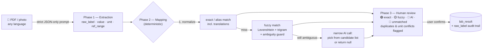

<p align="center">
  
</p>

<h1 align="center">Soma</h1>

<p align="center">
  <b>Personal Health Dashboard</b> — privacy-first, local-first, yours.<br/>
  One timeline for labs, medications, doctor visits and diagnoses,<br/>
  built for people who move between countries and run regular blood-work cycles.
</p>

<p align="center">
  <a href="https://github.com/mdportnov/soma/actions/workflows/ci.yml"></a>
  <a href="https://github.com/mdportnov/soma/actions/workflows/release.yml"></a>
  <a href="LICENSE"></a>
  
</p>

<p align="center">
  
  
  
  
  
  
</p>

---

## Why Soma

If you don't have a permanent medical record in one country — you travel, you relocate, you do a
biohacking blood panel every 3–6 months in whatever lab is nearby — your health data ends up
scattered across PDFs, photos and memory. Soma puts all of it into a single local database with
one defining feature competitors don't have:

> **The medication overlay.** Toggle any drug or supplement on a biomarker's trend chart and see
> its intake period as a band over the graph — _"started taking X at dose Y → marker Z moved"_ at
> a glance.

Everything else follows from that: a seeded biomarker dictionary with reference _and_ optimal
ranges, a unified horizontal timeline of every health event, and an AI import pipeline that turns
a photo of a lab report in any language into structured, reviewed, unit-normalized results.

## Features

- 🧬 **Biomarker dictionary** — ~65 seeded markers (CBC, lipids, hormones, thyroid, vitamins, …)
  with reference & optimal ranges, multilingual aliases (EN/RU), custom markers supported
- 📈 **Trend charts** — value over time with shaded norm/optimal bands and out-of-range markers
- 💊 **Medications & supplements** — dose, schedule, intake periods, purpose; overlay on any chart
- 🩺 **Visits, diagnoses, prescriptions** — full CRUD, linked together
- 🗓️ **Unified timeline** — labs, visits, diagnoses as dots, medication periods as bars, one scale
- 🤖 **AI import** (bring your own key) — PDF/photo in any language → structured extraction →
  deterministic dictionary mapping → **mandatory human review** before anything is saved
- 🌍 **Cross-country units** — Cyrillic-aware unit normalization + per-analyte molar conversions
  (mg/dL ↔ mmol/L, nmol/L ↔ ng/mL, …); unknown conversions are flagged, never guessed
- 📤 **No lock-in** — full JSON export, lab results CSV export
- 🌗 Light/dark theme, responsive, keyboard-friendly desktop UI

## Privacy model

| Principle          | Implementation                                                                                                                    |
| ------------------ | --------------------------------------------------------------------------------------------------------------------------------- |
| Local-first        | All data in a local SQLite file; fully functional offline                                                                         |
| AI is opt-in       | Disabled by default; every AI surface shows a stub until you add a key                                                            |
| Keys in keychain   | API keys live in the OS keychain (macOS Keychain / Windows Credential Manager / Secret Service) — never in the DB or config files |
| Explicit egress    | Documents are sent to your chosen AI provider only when you click import; network access is scoped to provider APIs only          |
| Auditability       | Every imported value keeps its original `raw_label` from the source document                                                      |
| Not medical advice | Every AI output carries a disclaimer                                                                                              |

## Getting started

### Download

Grab the installer for your OS from [**Releases**](https://github.com/mdportnov/soma/releases) —
`.dmg` (macOS, Apple Silicon & Intel), `.msi`/`.exe` (Windows), `.deb`/`.rpm`/`.AppImage` (Linux).

### Build from source

Prerequisites: **Node 22+**, **pnpm**, **Rust (stable)** and the
[Tauri system dependencies](https://tauri.app/start/prerequisites/) for your OS.

```bash
git clone https://github.com/mdportnov/soma.git
cd soma
pnpm install
pnpm tauri icon src-tauri/icons/icon.png   # generate platform icon set (once)
pnpm tauri dev                             # run the app
pnpm tauri build                           # production installers
```

## Development

| Command                     | What it does                                                   |
| --------------------------- | -------------------------------------------------------------- |
| `pnpm tauri dev`            | Run the desktop app with hot reload                            |
| `pnpm dev`                  | Frontend only (Vite dev server; DB requires the Tauri shell)   |
| `pnpm lint` / `pnpm format` | ESLint / Prettier (write mode; `format:check` in CI)           |
| `pnpm typecheck`            | `tsc --noEmit`                                                 |
| `pnpm build`                | Typecheck + production frontend build                          |
| `pnpm db:generate`          | Regenerate Drizzle migrations after editing `src/db/schema.ts` |
| `cargo fmt && cargo clippy` | Rust formatting / lints (run inside `src-tauri/`)              |

CI (`.github/workflows/ci.yml`) runs Prettier, ESLint, TypeScript, the frontend build, a
migrations-up-to-date check, `rustfmt` and `clippy` on every push and PR.
Releases (`.github/workflows/release.yml`) build installers for **macOS (arm64 + x86_64),
Windows and Linux** and attach them to a draft GitHub Release on every `v*` tag.

## Architecture

```
src/
├── db/
│   ├── schema.ts             # Drizzle schema — single source of truth
│   ├── migrations/           # generated by drizzle-kit, applied in-app at startup
│   ├── client.ts             # Drizzle over tauri-plugin-sql (sqlite-proxy driver)
│   ├── seed-biomarkers.ts    # seeded dictionary with ranges + EN/RU aliases
│   └── repos.ts              # typed data access + unified timeline selector
├── ai/
│   ├── model-registry.json   # configurable model list (vision/pdf flags), no hardcoded models
│   ├── types.ts              # AIProvider: extractFromDocument / mapBiomarker / chat
│   ├── providers/            # Anthropic · OpenAI · Gemini · OpenRouter adapters
│   ├── pipeline/map.ts       # deterministic mapping: normalize → exact/alias → fuzzy → AI
│   └── keystore.ts           # OS keychain bridge (Rust commands)
├── pages/                    # Dashboard · Timeline · Biomarkers · Labs · Import wizard ·
│                             # Medications · Visits · Diagnoses · Settings
└── components/
    ├── charts/TrendChart.tsx          # ref/optimal bands + medication overlay
    └── charts/HorizontalTimeline.tsx  # all events on one horizontal scale
src-tauri/                    # Rust shell: SQL/dialog/fs/http plugins + keyring commands
```

### AI import pipeline

The pipeline is collision-proof by design: the model never invents biomarkers, mapping is
deterministic code, and nothing reaches the database without human confirmation.



## Roadmap

### ✅ v0.1 — MVP core _(current)_

- [x] Drizzle/SQLite schema + migrations for all entities
- [x] Biomarker dictionary with reference/optimal ranges, aliases, custom markers
- [x] Manual lab entry → trend charts with range bands
- [x] Medications/supplements with intake periods + **overlay on biomarker charts**
- [x] Visits, diagnoses, prescriptions
- [x] Unified horizontal timeline
- [x] AI settings: provider/model registry, keychain, key validation, stubs when disabled
- [x] AI import: extraction → deterministic mapping → review UI
- [x] JSON/CSV export, light/dark theme

### 🔜 v0.2 — Quality of life

- [ ] Side-by-side comparison of two lab dates
- [ ] Medication adherence log UI (`medication_log` is already in the schema)
- [ ] Attachment viewer (open source PDF/photo from a panel)
- [ ] Expanded unit conversion table & per-lab unit memory
- [ ] UI localization (Russian first)
- [ ] In-app biomarker dictionary editor (ranges, aliases)

### 🧠 v0.3 — AI analysis & research

- [ ] AI chat with full health context (trends, meds, diagnoses)
- [ ] Trend interpretation summaries with the mandatory disclaimer
- [ ] Personal research knowledge base — your PDFs as RAG sources with citations
- [ ] Lifestyle context cards (sleep, training, stress) to enrich AI analysis

### 🚀 v1.0 — Sync & sharing

- [ ] Encrypted Google Drive backup (`appDataFolder`, E2E via age/libsodium)
- [ ] PDF report generator for doctors
- [ ] Reminders: medication intake & scheduled re-testing (every N months)
- [ ] Multi-profile (family) + viewer-role sharing
- [ ] Optional at-rest database encryption

## Tech stack

| Layer    | Choice                                                                        |
| -------- | ----------------------------------------------------------------------------- |
| Shell    | [Tauri 2](https://tauri.app) — Rust core, ~10 MB bundle                       |
| Frontend | React 19 + TypeScript + Vite                                                  |
| Styling  | Tailwind CSS v4, shadcn-style component kit, lucide icons                     |
| Charts   | Recharts                                                                      |
| Database | SQLite (`tauri-plugin-sql`) + Drizzle ORM                                     |
| AI       | Multi-provider behind one `AIProvider` interface; multimodal models only      |
| Secrets  | OS keychain via the Rust `keyring` crate                                      |
| CI/CD    | GitHub Actions: lint/typecheck/build matrix + cross-platform release pipeline |

## Contributing

### Branching workflow

- `master` is the stable branch — always green, never force-pushed, no direct commits.
- Features: branch from `master` as `feature/<name>` (e.g. `feature/onboarding`).
- Fixes: branch from `master` as `fix/<name>`.
- All changes land in `master` via a PR, merged with **squash merge** — one clean commit
  per feature/fix; delete the branch after merge.

### Checks

Issues and PRs are welcome. Before pushing, please run:

```bash
pnpm format && pnpm lint && pnpm typecheck && pnpm build
cd src-tauri && cargo fmt && cargo clippy --all-targets
```

Conventions: schema changes go through `src/db/schema.ts` + `pnpm db:generate` (never edit
generated SQL by hand), AI behavior changes go through `src/ai/prompts.ts` and
`src/ai/pipeline/`, and new AI providers are adapters in `src/ai/providers/` — the pipeline
itself must stay vendor-agnostic.

## License

[MIT](LICENSE) © Mikhail Portnov

> **Disclaimer:** Soma is a personal data-organization tool, not a medical device. Nothing in the
> app — including AI-generated summaries — is medical advice. Always consult a qualified
> clinician.
