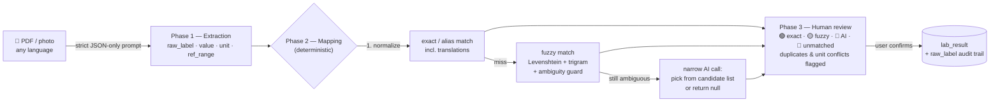

<p align="center">
  
</p>

<h1 align="center">Soma</h1>

<p align="center">
  <b>Personal Health Dashboard</b> — privacy-first, local-first, yours.<br/>
  One timeline for labs, medications, doctor visits and diagnoses,<br/>
  built for people who move between countries and run regular blood-work cycles.
</p>

<p align="center">
  <a href="https://github.com/mdportnov/soma/actions/workflows/ci.yml"></a>
  <a href="https://github.com/mdportnov/soma/actions/workflows/release.yml"></a>
  <a href="LICENSE"></a>
  
</p>

<p align="center">
  
  
  
  
  
  
</p>

---

## Install Soma

Download the installer for your operating system from
[**GitHub Releases**](https://github.com/mdportnov/soma/releases). Installed builds are normal
desktop applications; using Soma does not require developer tools or a terminal.

| Platform | Release artifact                                             |
| -------- | ------------------------------------------------------------ |
| macOS    | One universal `.dmg` for Apple Silicon and Intel             |
| Windows  | Current-user NSIS `-setup.exe`                               |
| Linux    | `.AppImage`, `.deb` or `.rpm`, depending on the distribution |

### macOS

Soma has no Apple Developer certificate. The application is ad-hoc signed but not notarized, so
macOS requires a one-time approval on first launch:

1. Open the universal `.dmg` and drag **Soma** to **Applications**.
2. Try to open Soma from Applications. macOS will block this first attempt.
3. Open **System Settings → Privacy & Security**, scroll to **Security**, and click **Open Anyway**.
4. Confirm **Open**.

Later launches work normally from Finder, Spotlight, Launchpad or the Dock. Every release includes
`SHA256SUMS.txt` for artifact-integrity verification.

### Windows

Run the `-setup.exe` from Explorer. It installs for the current user, adds normal Start Menu
integration without requiring administrator access, and bootstraps WebView2 if the runtime is
missing.

The installer is currently unsigned. Defender SmartScreen can show an unknown-publisher warning;
Windows 11 with Smart App Control in enforcement mode can block unknown unsigned applications
entirely. An installer script cannot bypass that Windows policy.

### Linux

On Ubuntu/Debian, open the `.deb` with the graphical software installer. On Fedora/RHEL, open the
`.rpm`. The AppImage is portable; if the browser removed its executable permission, enable
**Allow executing file as program** in the file manager's Properties dialog before double-clicking
it.

## Build from source

Clone the repository and run one native build script. Each script provisions the pinned Node,
pnpm, Rust and Bun versions, installs the locked workspace and writes final packages under
`artifacts/<platform>/`.

### macOS

Requires macOS 13+ and Xcode Command Line Tools. Homebrew is only needed when `mise` is not already
installed.

```sh
git clone https://github.com/mdportnov/soma.git
cd soma
./scripts/build-macos.sh
```

Output: universal `artifacts/macos/Soma.app` and `.dmg`.

### Windows

Requires current x64 Windows 10/11, PowerShell, WinGet and Git. The script installs the Microsoft
C++ Build Tools workload and `mise`; the one-time Build Tools setup can request administrator
approval.

```powershell
git clone https://github.com/mdportnov/soma.git
cd soma
powershell -NoProfile -ExecutionPolicy Bypass -File .\scripts\build-windows.ps1
```

Output: NSIS installer under `artifacts/windows/`.

### Linux

Supports current Debian/Ubuntu, Fedora and Arch-family distributions. The script uses `sudo` to
install the required native packages through apt, dnf or pacman.

```sh
git clone https://github.com/mdportnov/soma.git
cd soma
./scripts/build-linux.sh
```

Output: `.deb`, `.rpm` and `.AppImage` under `artifacts/linux/`. Install or enable a freedesktop
Secret Service provider such as `gnome-keyring` or KWallet for key storage. Exact support boundaries
are documented in [platform support](docs/platform-support.md).

## Why Soma

If you don't have a permanent medical record in one country — you travel, you relocate, you do a
biohacking blood panel every 3–6 months in whatever lab is nearby — your health data ends up
scattered across PDFs, photos and memory. Soma puts all of it into a single local database with
one defining feature competitors don't have:

> **The medication overlay.** Toggle any drug or supplement on a biomarker's trend chart and see
> its intake period as a band over the graph — _"started taking X at dose Y → marker Z moved"_ at
> a glance.

Everything else follows from that: a seeded biomarker dictionary with reference _and_ optimal
ranges, a unified horizontal timeline of every health event, and an AI import pipeline that turns
a photo of a lab report in any language into structured, reviewed, unit-normalized results.

## Features

- 🧬 **Biomarker dictionary** — ~180 seeded markers (CBC, lipids, hormones, thyroid, vitamins, …)
  with reference & optimal ranges, **sex/age-specific ranges**, plain-language explanations (EN/RU),
  multilingual aliases, custom markers supported
- 📈 **Trend charts** — value over time with shaded norm/optimal bands, **clinically-aware
  out-of-range & critical flags**, cross-panel change detection, and **side-by-side comparison of
  two lab dates**
- 💊 **Medications & supplements** — dose, schedule, intake periods, purpose; overlay on any chart;
  **drug-allergy interaction warnings** and an **adherence log** (mark taken/skipped, % + streak)
- 🩺 **Visits, diagnoses, prescriptions** — full CRUD, linked together with detail pages
- 🚑 **Allergies & Emergency Card** — severity-aware allergy records (anaphylactic entries are
  protected from deletion) and a printable emergency summary (blood type, conditions, meds, allergies)
- 💉 **Vaccines** — records with dose series & expiry, a WHO childhood-immunization calendar, and
  travel/actionable vaccine guidance
- 🩻 **Imaging** — X-ray / CT / MRI / ultrasound / … records, entered manually or AI-imported
- 📓 **Journal** — weight, blood pressure and symptom logs, with weight-goal projection
- 🗓️ **Unified timeline** — labs, visits, diagnoses as dots, medication periods as bars, one scale
- 🤖 **AI import** (bring your own key) — PDF/photo in any language for **labs, vaccine certificates,
  discharge summaries, imaging reports, prescriptions and allergy records** → structured extraction →
  deterministic dictionary mapping → **mandatory human review** before anything is saved
- ✨ **AI assistant** (bring your own key) — a **health-context chat** and one-tap **trend
  interpretation** on any biomarker; vendor-agnostic, with a not-medical-advice disclaimer on every answer
- 🌙 **Lifestyle context** — daily **sleep, training and stress/energy** cards that enrich the AI
  health context; manual entry today, with a designed path to Apple Health / Google Fit sync
- 🔔 **Reminders feed** — medication-intake nudges and **scheduled re-testing** (every N months) as
  passive, **in-app** notifications; nothing leaves your device, no OS notifications
- 🖨️ **Doctor report** — a configurable **PDF summary** (problems, meds, allergies, recent labs) to
  hand a clinician, generated entirely on-device
- 🔎 **Search & Command Palette** — full-text search (SQLite FTS5) across every record, ⌘K palette
- 🔐 **Encrypted backups** — AES-256-GCM snapshots (Argon2id key) into your own cloud-synced folder
  (iCloud / Drive / Dropbox / OneDrive); the live database never leaves the device
- 🔒 **Optional at-rest encryption** — keep the live database encrypted on disk while the app is
  closed (Argon2id + AES-256-GCM), unlocked automatically via the OS keychain or with a passphrase
- 🧰 **Local MCP server** — typed stdio tools over your `soma.db` for AI assistants, one-click setup
- 🌍 **Cross-country units** — Cyrillic-aware unit normalization + per-analyte molar conversions
  (mg/dL ↔ mmol/L, nmol/L ↔ ng/mL, …); unknown conversions are flagged, never guessed
- 📤 **No lock-in** — full JSON export, lab results CSV export
- 🌗 Light/dark theme, **EN/RU localization**, responsive, keyboard-friendly desktop UI

## Privacy model

| Principle          | Implementation                                                                                                                                  |
| ------------------ | ----------------------------------------------------------------------------------------------------------------------------------------------- |
| Local-first        | All data in a local SQLite file; fully functional offline                                                                                       |
| AI is opt-in       | Disabled by default; every AI surface shows a stub until you add a key                                                                          |
| Keys in keychain   | API keys live in the OS keychain (macOS Keychain / Windows Credential Manager / Secret Service) — never in the DB or config files               |
| Explicit egress    | Documents are sent to your chosen AI provider only when you click import; network access is scoped to provider APIs only                        |
| Encrypted backups  | Snapshots are AES-256-GCM encrypted with an Argon2id key from your passphrase before reaching a cloud-synced folder — unreadable without it     |
| At-rest encryption | Optional: the live database is kept encrypted on disk (Argon2id + AES-256-GCM) whenever the app is closed; in the clear only while the app runs |
| Auditability       | Every imported value keeps its original `raw_label` from the source document                                                                    |
| Not medical advice | Every AI output carries a disclaimer                                                                                                            |

## Development

| Command                                     | What it does                                                         |
| ------------------------------------------- | -------------------------------------------------------------------- |
| `pnpm setup:linux`                          | Install Linux system/toolchain dependencies and workspace packages   |
| `pnpm setup:macos`                          | Install the pinned macOS development toolchain and dependencies      |
| `pnpm setup:windows`                        | Install Windows build dependencies and workspace packages            |
| `pnpm build:linux`                          | Build `.deb`, `.rpm` and `.AppImage` into `artifacts/linux/`         |
| `pnpm build:macos`                          | Build the universal macOS `.app` + `.dmg` into `artifacts/macos/`    |
| `pnpm build:windows`                        | Build the NSIS installer into `artifacts/windows/`                   |
| `pnpm tauri dev`                            | Run the desktop app with hot reload                                  |
| `pnpm dev`                                  | Frontend only (Vite dev server; DB requires the Tauri shell)         |
| `pnpm lint` / `pnpm format`                 | ESLint / Prettier (write mode; `format:check` in CI)                 |
| `pnpm typecheck`                            | `tsc --noEmit`                                                       |
| `pnpm build`                                | Typecheck + production frontend build                                |
| `pnpm verify`                               | Run all JS/TS formatting, lint, typecheck, test and build gates      |
| `pnpm version:check`                        | Verify release versions and the current Git tag are consistent       |
| `pnpm db:generate`                          | Regenerate Drizzle migrations after editing `src/db/schema.ts`       |
| `pnpm mcp:sidecar`                          | Compile the MCP sidecar for the host (auto-run by `tauri dev/build`) |
| `cargo fmt` / `cargo clippy` / `cargo test` | Rust gates (run inside `src-tauri/`)                                 |

CI (`.github/workflows/ci.yml`) runs version consistency, Prettier, ESLint, TypeScript, tests, the
frontend build, a migrations-up-to-date check, sidecar builds on all desktop operating systems,
`rustfmt`, `clippy` and Rust tests on every push and PR. A weekly packaging smoke build tracks the
GitHub macOS and Windows images plus the Ubuntu 22.04 release baseline. A `v*` tag runs the release gates, builds one
universal macOS installer plus Windows and Linux installers, adds SHA-256 checksums, and only then
publishes the GitHub Release. See [the release runbook](docs/releasing.md).

## Architecture

```
src/
├── db/
│   ├── schema.ts             # Drizzle schema — single source of truth
│   ├── migrations/           # generated by drizzle-kit, applied in-app at startup
│   ├── client.ts             # Drizzle over tauri-plugin-sql (sqlite-proxy driver)
│   ├── seed-biomarkers.ts    # seeded dictionary (~180) with ranges + EN/RU aliases
│   ├── search.ts             # SQLite FTS5 full-text search across records
│   └── repos.ts              # typed data access + unified timeline selector
├── ai/
│   ├── model-registry.json   # configurable model list (vision/pdf flags), no hardcoded models
│   ├── types.ts              # AIProvider: extractStructured / mapBiomarker / chat / testKey
│   ├── prompts.ts            # all extraction prompts + the mandatory AI disclaimer
│   ├── providers/            # Anthropic · OpenAI · Gemini · OpenRouter adapters
│   ├── import/               # doc-type registry: lab · vaccine · discharge · imaging ·
│   │                         #   prescription · allergy (extract → validate → review → save)
│   ├── pipeline/map.ts       # deterministic mapping: normalize → exact/alias → fuzzy → AI
│   └── keystore.ts           # OS keychain bridge (Rust commands)
├── pages/                    # Dashboard · Timeline · Biomarkers · Labs · Import wizard ·
│                             #   Medications · Visits · Diagnoses · Allergies · Vaccines ·
│                             #   Imaging · Journal · Lifestyle · Notifications · Doctor report ·
│                             #   Emergency card · Onboarding · Settings
└── components/
    ├── app/CommandPalette.tsx         # ⌘K search/navigation
    ├── charts/TrendChart.tsx          # ref/optimal bands + medication overlay
    └── charts/HorizontalTimeline.tsx  # all events on one horizontal scale
src-tauri/                    # Rust shell: SQL/dialog/fs/http plugins + keyring commands
    ├── backup.rs             # encrypted .somabk snapshots (Argon2id + AES-256-GCM)
    ├── vault.rs              # optional at-rest DB encryption (encrypt-when-closed vault)
    └── mcp.rs                # one-click local MCP server setup
```

### AI import pipeline

The pipeline is collision-proof by design: the model never invents biomarkers, mapping is
deterministic code, and nothing reaches the database without human confirmation.



## Tech stack

| Layer    | Choice                                                                        |
| -------- | ----------------------------------------------------------------------------- |
| Shell    | [Tauri 2](https://tauri.app) — native Rust desktop shell                      |
| Frontend | React 19 + TypeScript + Vite                                                  |
| Styling  | Tailwind CSS v4, shadcn-style component kit, lucide icons                     |
| Charts   | Recharts                                                                      |
| Database | SQLite (`tauri-plugin-sql`) + Drizzle ORM                                     |
| AI       | Multi-provider behind one `AIProvider` interface; multimodal models only      |
| Secrets  | OS keychain via the Rust `keyring` crate                                      |
| CI/CD    | GitHub Actions: lint/typecheck/build matrix + cross-platform release pipeline |

## Contributing

### Branching workflow

- `master` is the stable branch — always green, never force-pushed, no direct commits.
- Features: branch from `master` as `feature/<name>` (e.g. `feature/onboarding`).
- Fixes: branch from `master` as `fix/<name>`.
- All changes land in `master` via a PR, merged with **squash merge** — one clean commit
  per feature/fix; delete the branch after merge.

### Checks

Issues and PRs are welcome. After running the platform setup script, use the same quality gates as
CI before pushing:

```bash
pnpm verify
cd src-tauri
cargo fmt --check
cargo clippy --all-targets -- -D warnings
cargo test
```

Conventions: schema changes go through `src/db/schema.ts` + `pnpm db:generate` (never edit
generated SQL by hand), AI behavior changes go through `src/ai/prompts.ts` and
`src/ai/pipeline/`, and new AI providers are adapters in `src/ai/providers/` — the pipeline
itself must stay vendor-agnostic.

## License

[MIT](LICENSE) © Mikhail Portnov

> **Disclaimer:** Soma is a personal data-organization tool, not a medical device. Nothing in the
> app — including AI-generated summaries — is medical advice. Always consult a qualified
> clinician.
